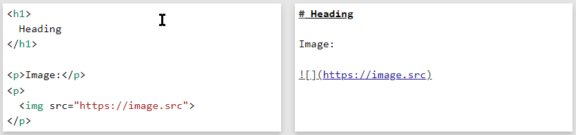
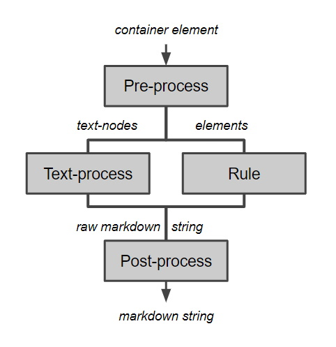

<h1 align="center">
  <picture>
    <source media="(prefers-color-scheme: dark)" srcset="./assets/title_dark.webp">
    <source media="(prefers-color-scheme: light)" srcset="./assets/title_light.webp">
    
  </picture>
</h1>

<div align="center">

[![Coverage][coverage-badge]][coverage-link]
[![Version][version-badge]][version-link]
[![License][license-badge]][license-link]

</div>

[coverage-badge]: https://badgen.net/codecov/c/github/EvitanRelta/htmlarkdown?color=009900
[coverage-link]: https://codecov.io/gh/EvitanRelta/htmlarkdown
[version-badge]: https://badgen.net/github/release/EvitanRelta/htmlarkdown
[version-link]: https://github.com/EvitanRelta/htmlarkdown/releases/latest
[license-badge]: https://badgen.net/github/license/EvitanRelta/htmlarkdown
[license-link]: https://badgen.net/github/license/EvitanRelta/htmlarkdown

<br>

HTMLarkdown is a **<ins>HTML-to-Markdown converter</ins>** that's able to output HTML-syntax when required.  
Like when center-aligning, or resizing images:

<p align="center">
  <picture>
    <source media="(prefers-color-scheme: dark)" srcset="./assets/html_switching_dark.gif">
    <source media="(prefers-color-scheme: light)" srcset="./assets/html_switching_light.gif">
    
  </picture>
</p>

- Written completely in  **<ins>TypeScript</ins>**.  
- Has many Jest [tests](./tests), covering many edge-case conversions.
  > _[Leave a issue/PR](#new-conversions-ideas-features-tests) if you can think of more!_
- [For now](#other-markdown-specs), is designed for [GFM].
- Try it out at the demo site below!  
  https://evitanrelta.github.io/htmlarkdown

[GFM]: https://github.github.com/gfm/

<br>

# How is this different?

## Switching to HTML-syntax

Whenever elements **<ins>cannot be represented</ins>** in markdown-syntax, HTMLarkdown will **<ins>switch to HTML-syntax</ins>**:

<table>
    <thead>
        <tr>
            <th width=500>Input HTML</th>
            <th width=500>Output Markdown</th>
        </tr>
    </thead>
    <tbody>
        <tr>
            <td>
<pre lang="html"><code>&lt;h1>Normal-heading is &lt;strong>boring&lt;/strong>&lt;/h1>
<!-- BLANK_LINE -->
&lt;h1 align="center">
  Centered-heading is &lt;strong>da wae&lt;/strong>
&lt;/h1>
<!-- BLANK_LINE -->
&lt;p>&lt;img src="https://image.src" />&lt;/p>
<!-- BLANK_LINE -->
&lt;p>&lt;img width="80%" src="https://image.src" />&lt;/p>
</code></pre>
            </td>
            <td>
<pre lang="html"><code># Normal-heading is **boring**
<!-- BLANK_LINE -->
&lt;h1 align="center">
  Centered-heading is &lt;b>da wae&lt;/b>
&lt;/h1>
<!-- BLANK_LINE -->

<!-- BLANK_LINE -->
&lt;img width="80%" src="https://image.src" />
</code></pre>
            </td>
        </tr>
    </tbody>
</table>

> _**Note:** The HTML-switching is controlled by the rules' `Rule.toUseHtmlPredicate`._

<br>

But HTMLarkdown tries to use as **<ins>little HTML-syntax</ins>** as possible. **<ins>Mixing markdown and HTML</ins>** if needed:

<table>
    <thead>
        <tr>
            <th width=500>Input HTML</th>
            <th width=500>Output Markdown</th>
        </tr>
    </thead>
    <tbody>
        <tr>
            <td>
<pre lang="html"><code>&lt;blockquote>
  &lt;p align="center">
    Centered-paragraph
  &lt;/p>
  &lt;p>Below is a horizontal-rule in blockquote:&lt;/p>
  &lt;hr>
&lt;/blockquote>
</code></pre>
            </td>
            <td>
<pre lang="html"><code>> &lt;p align="center">
>   Centered-paragraph
> &lt;/p>
> Below is a horizontal-rule in blockquote:
> 
> &lt;hr>
</code></pre>
            </td>
        </tr>
    </tbody>
</table>

<br>

Depending on the situation, HTMLarkdown will switch between markdown's **<ins>backslash-escaping</ins>** or **<ins>HTML-escaping</ins>**:

<table>
    <thead>
        <tr>
            <th width=500>Input HTML</th>
            <th width=500>Output Markdown</th>
        </tr>
    </thead>
    <tbody>
        <tr>
            <td>
<pre lang="html"><code>&lt;!-- In markdown -->
&lt;p>&amp;lt;TAG&amp;gt;, **NOT BOLD**&lt;/p>
<!-- BLANK_LINE -->
&lt;!-- In in-line HTML -->
&lt;p>
  &lt;sup>&amp;lt;TAG&amp;gt;, **NOT BOLD**&lt;/sup>
&lt;/p>
<!-- BLANK_LINE -->
&lt;!-- In block HTML -->
&lt;p align="center">
  &amp;lt;TAG&amp;gt;, **NOT BOLD**
&lt;/p>
</code></pre>
            </td>
            <td>
<pre lang="html"><code>\&lt;TAG>, \*\*NOT BOLD\*\*
<!-- BLANK_LINE -->
&lt;sup>\&lt;TAG>, \*\*NOT BOLD\*\*&lt;/sup>
<!-- BLANK_LINE -->
&lt;p align="center">
  &amp;lt;TAG>, **NOT BOLD**
&lt;/p>
</code></pre>
            </td>
        </tr>
    </tbody>
</table>

<br>

## Handling of edge cases

Adding separators in-between adjacent lists to prevent them from being combined by markdown-renderers:

<table>
    <thead>
        <tr>
            <th width=500>Input HTML</th>
            <th width=500>Output Markdown</th>
        </tr>
    </thead>
    <tbody>
        <tr>
            <td>
<pre lang="html"><code>&lt;ul>
  &lt;li>List 1 > item 1&lt;/li>
  &lt;li>List 1 > item 2&lt;/li>
&lt;/ul>
&lt;ul>
  &lt;li>List 2 > item 1&lt;/li>
  &lt;li>List 2 > item 2&lt;/li>
&lt;/ul>
</code></pre>
            </td>
            <td>
<pre lang="html"><code>- List 1 > item 1
- List 1 > item 2
<!-- BLANK_LINE -->
&lt;!-- LIST_SEPARATOR -->
<!-- BLANK_LINE -->
- List 2 > item 1
- List 2 > item 2
</code></pre>
            </td>
        </tr>
    </tbody>
</table>

And more!  
But this section is getting too long so...

<br>

# Installation

```bash
npm install htmlarkdown
```

<br>

# Usage

## Markdown conversion _(either from `Element` or `string`)_

```js
import { HTMLarkdown } from 'htmlarkdown'

/** Convert an element! */
const htmlarkdown = new HTMLarkdown()
const container = document.getElementById('container')
console.log(container.outerHTML)
// => '<div id="container"><h1>Heading</h1></div>'
htmlarkdown.convert(container)
// => '# Heading'


/** 
 * Or a HTML string! 
 * Whichever u prefer. It's 2022, I don't judge :^)
 */
const htmlString = `
<h1>Heading</h1>
<p>Paragraph</p>
`
const htmlStrWithContainer = `<div>${htmlString}</div>`
htmlarkdown.convert(htmlString)
// Set 2nd param 'hasContainer' to true, for container-wrapped string.
htmlarkdown.convert(htmlStrWithContainer, true)
// Both output => '# Heading\n\nParagraph'
```

> <a id="deep-clone"></a>
> **Note:** If an element is given to `convert`, it's deep-cloned before any processing/conversion.  
> Thus, you don't have to worry about it mutating the original element :)

<br>

## Configuring

```js
/** Configure when creating an instance. */
const htmlarkdown = new HTMLarkdown({
    htmlEscapingMode: '&<>',
    maxPrettyTableWidth: Number.POSITIVE_INFINITY,
    addTrailingLinebreak: true
})

/** Or on an existing instance. */
htmlarkdown.options.maxPrettyTableWidth = -1
```

<br>

## Plugins

Plugins are of type `(htmlarkdown: HTMLarkdown): void`.  
They take in a `HTMLarkdown` instance and configure it by **<ins>mutating</ins>** it.

There's 2 plugin-options available in the `options` object: `preloadPlugins` and `plugins`.  
The difference is:
- `preloadPlugins` loads the plugins **<ins>first</ins>**, before your other options. _(likes "presets")_  
  Allowing you to overwrite the plugins' changes:
  ```ts
  const enableTrailingLinebreak: Plugin = (htmlarkdown) => {
      htmlarkdown.options.addTrailingLinebreak = true
  }
  const htmlarkdown = new HTMLarkdown({
      addTrailingLinebreak: false,
      preloadPlugins: [enableTrailingLinebreak],
  })
  htmlarkdown.options.preloadPlugins // false
  ```
- `plugins` loads the plugins **<ins>after</ins>** your other options.  
  Meaning, plugins can overwrite your options.
  ```ts
  const enableTrailingLinebreak: Plugin = (htmlarkdown) => {
      htmlarkdown.options.addTrailingLinebreak = true
  }
  const htmlarkdown = new HTMLarkdown({
      addTrailingLinebreak: false,
      plugins: [enableTrailingLinebreak],
  })
  htmlarkdown.options.preloadPlugins // true
  ```

<br>

You can also load plugins on existing instances:
```js
htmlarkdown.loadPlugins([myPlugin])
```

<br>

## Making a copy of an instance

The conversion of a `HTMLarkdown` instance **<ins>solely</ins>** depends on its `options` property.  
Meaning, you create a copy of an instance like this:

```js
const htmlarkdown = new HTMLarkdown()
const copy = new HTMLarkdown(htmlarkdown.options)
```

<br>

## Configuring rules/processes

See [this section](#how-it-works) for info on what the rules/processes do.

```js
/**
 * Overwriting default rules/processes.
 * (does NOT include the defaults)
 */
const htmlarkdown = new HTMLarkdown({
    preProcesses: [myPreProcess1, myPreProcess2],
    rules: [myRule1, myRule2],
    textProcesses: [myTextProcess1, myTextProcess2],
    postProcesses: [myPostProcess1, myPostProcess2]
})

/**
 * Adding on to default rules/processes.
 * (includes the defaults)
 */
const htmlarkdown = new HTMLarkdown()
htmlarkdown.addPreProcess(myPreProcess)
htmlarkdown.addRule(myRule)
htmlarkdown.addTextProcess(myTextProcess)
htmlarkdown.addPostProcess(myPostProcess)
```

<br>

# How it works

HTMLarkdown has 3 distinct phases:

1. **Pre-processing**  
   The container-element that's received _(and [deep-cloned](#deep-clone))_ by the `convert` method is passed consecutively to each `PreProcess` in `options.preProcesses`.

2. **Conversion**  
   The pre-processed container-element is then recursively converted to markdown.  
   Elements are converted by `Rule` in `options.rules`.  
   Text-nodes are converted by `TextProcess` in `options.textProcesses`.  
   The rule/text-process outputs strings are then appended to each other, to give the raw markdown.

3. **Post-processing**  
   The raw markdown string is then passed consecutively to each `PostProcess` in `options.postProcess`, to give the final markdown.

<p align="center">
  <picture>
    <source media="(prefers-color-scheme: dark)" srcset="./assets/rule_processes_flow_chart_dark.jpg">
    <source media="(prefers-color-scheme: light)" srcset="./assets/rule_processes_flow_chart_light.jpg">
    
  </picture>
  <br><i>(<b>image:</b> the general conversion flow of HTMLarkdown)</i>
</p>

<br>

# Contributing

## Bugs

HTMLarkdown is still under-development, so there'll likely be bugs.

So the easiest way to contribute is submit an issue _(with the `bug` label)_, especially for any incorrect markdown-conversions :)

For any incorrect markdown-conversions, state the:
- input HTML
- current incorrect markdown output
- expected markdown output

<br>

## New conversions, ideas, features, tests

If you have any new elements-conversions / ideas / features / tests that you think should be added, leave an issue with `feature` or `improve` label!

> - `feature` label is for new features
> - `improve` label is for improvements on existing features
> 
> Understandably, there are gray areas on what is a "feature" and what is an "improvement". So just go with whichever seems more appropriate :)

<br>

## Other markdown specs
Currently, HTMLarkdown has been designed to output markdown for GitHub specifically _(ie. [GFM])_.  
BUT, if there's another markdown spec. that you'd like to design for _(maybe as a plugin?)_, do leave an issue/discussion :D

[GFM]: https://github.github.com/gfm/

<br>

## Coding-related stuff

Code-formatting is handled by [Prettier], so no need to worry bout it :)

Any new feature should 
- be documented via TSDoc
- come with new unit-tests for them
- and should pass all new/existing tests

As for which merging method to use, check out the [discussion][merging-discussion].

[merging-discussion]: https://github.com/EvitanRelta/htmlarkdown/discussions/41

<br>

[Prettier]: https://prettier.io/


# Contributors

So far it's just me, so pls send help! :^)

<br>

# Roadmap

If you've any new ideas / features, check out the [Contributing section for it](#new-conversions-ideas-features-tests)!

<br>

## Element conversions

### Block-elements:
- [x] Headings _([For now][setext-issue], only [ATX-style][atx])_
- [x] Paragraph
- [x] Codeblock
- [x] Blockquote
- [x] Lists  
  _(ordered, unordered, [tight][tight] and [loose][loose])_
- [x] _([GFM][gfm-table])_ Table
- [ ] _([GFM][gfm-task-list])_ Task-list
  <br><br>_(Below are some planned block-elements that don't have markdown-equivalent)_
- [x] `<span>` _(handled by a [noop-rule](#noop-rule))_
- [x] `<div>` _([For now][div-noop-issue], handled by a [noop-rule](#noop-rule))_
- [ ] Definition list _(ie. `<dl>`, `<dt>`, `<dd>`)_
- [ ] Collapsible section _(ie. `<details>`)_


[setext-issue]: https://github.com/EvitanRelta/htmlarkdown/issues/36
[atx]: https://spec.commonmark.org/0.30/#atx-heading
[div-noop-issue]: https://github.com/EvitanRelta/htmlarkdown/issues/19
[tight]: https://github.github.com/gfm/#tight
[loose]: https://github.github.com/gfm/#loose
[gfm-table]: https://github.github.com/gfm/#tables-extension-
[gfm-task-list]: https://github.github.com/gfm/#task-list-items-extension-

<br>

### Text-formattings:
- [x] **Bold** _([For now][underscore-issue], only outputs in asterisks `**BOLD**`)_
- [x] _Italic_ _([For now][underscore-issue], only outputs in asterisks `*ITALIC*`)_
- [x] _([GFM][gfm-strikethrough])_ ~~Strikethrough~~
- [x] `Code`
- [x] [Link][secret] _([For now][ref-link-issue], only [inline links][inline-link])_
- [x] <sup>Superscript</sup> _(ie. `<sup>`)_
- [x] <sub>Subscript</sub> _(ie. `<sub>`)_
- [x] <ins>Underline</ins> _(ie. `<u>`, `<ins>`)_  
  _(didn't know underlines possible till recently)_

[underscore-issue]: https://github.com/EvitanRelta/htmlarkdown/issues/39
[gfm-strikethrough]: https://github.github.com/gfm/#strikethrough-extension-
[secret]: https://www.youtube.com/watch?v=dQw4w9WgXcQ
[ref-link-issue]: https://github.com/EvitanRelta/htmlarkdown/issues/38
[inline-link]: https://spec.commonmark.org/0.30/#inline-link

<br>

Misc:
- [x] Images _([For now][ref-link-issue], only [inline links][inline-link])_
- [x] Horizontal-rule _(ie. `<hr>`)_
- [x] Linebreaks _(ie. `<brr>`)_
- [ ] Preserved HTML comments _([Issue \#25][preserve-comment-issue])_
  _(eg. `<!-- COMMENT -->`)_

[preserve-comment-issue]: https://github.com/EvitanRelta/htmlarkdown/issues/25

<br>

Features to be added:
- Custom `id` attributes
  ```html
  Go to [section with id](#my-section)

  <p id="my-section">
    My section
  </p>
  ```
- Reversing GitHub's Issue/PR autolinks
  <table>
      <thead>
          <tr>
              <th width=500>Input HTML</th>
              <th width=500>Output Markdown</th>
          </tr>
      </thead>
      <tbody>
          <tr>
              <td>
  <pre lang="html"><code>&lt;p>
    Issue autolink: 
    &lt;a href="https://github.com/user/repo/issues/7">#7&lt;/a>
  &lt;/p>
  </code></pre>
              </td>
              <td>
  <pre lang="html"><code>Issue autolink: #7
  </code></pre>
              </td>
          </tr>
      </tbody>
  </table>
- Ability to customise how codeblock's syntax-highlighting langauge is obtained from the `<pre><code>` elements

<br>

<blockquote id="noop-rule">
  <code>noop-rule</code>: 
  <br>They only pass-on their converted inner-contents to their parents.
  <br>They themselves don't have any markdown conversions, not even in HTML-syntax.
</blockquote>

<br>

# License

The MIT License (MIT).  
So it's freeeeeee